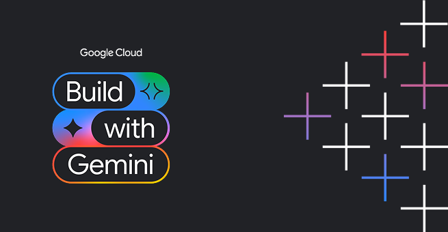
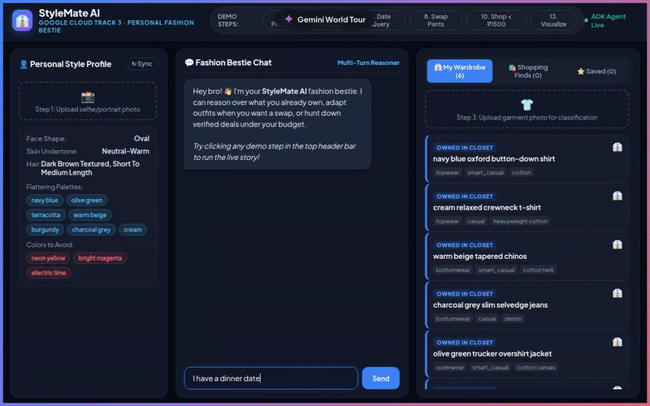
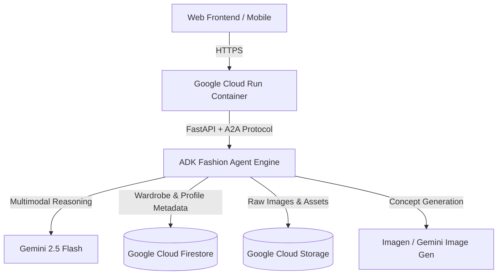

<div align="center">



# 👔 StyleMate AI — Personal AI Fashion Stylist for Men

### Built during the Google Cloud **Build with Gemini** (Track 3: Software Developer) Hackathon & World Tour

[](https://developers.google.com/events/community/build-with-gemini)
[](https://stylemate-ai-253708072271.europe-west1.run.app/stylemate)
[](https://deepmind.google/technologies/gemini/)
[](https://google.github.io/adk-docs/)
[](LICENSE)

<br/>

**Live Cloud Run Application:** [https://stylemate-ai-253708072271.europe-west1.run.app/stylemate](https://stylemate-ai-253708072271.europe-west1.run.app/stylemate)  
**Interactive ADK Dev UI:** [https://stylemate-ai-253708072271.europe-west1.run.app/dev-ui/](https://stylemate-ai-253708072271.europe-west1.run.app/dev-ui/)

</div>

---

## 🎬 Live Demo

Here is **StyleMate AI** analyzing personal style, organizing a virtual wardrobe, reasoning over dinner date outfits, iteratively modifying clothing components, and searching budget-filtered shopping catalogs:

<div align="center">



*Watch the high-definition recording: [`assets/stylemate_demo.mp4`](assets/stylemate_demo.mp4)*

</div>

---

## 🌟 What is StyleMate AI?

**StyleMate AI** is an **agent-first personal fashion assistant** designed specifically for men who want to look confident and well-dressed without spending hours figuring out what matches. 

Unlike traditional rule-based recommendation engines that simply match static tags, StyleMate operates as an autonomous reasoning agent powered by **Gemini multimodal models** and the **Google Agent Development Kit (ADK)**:

1. **Multimodal Style Profiling:** Analyzes user selfies to extract color season (e.g. *Warm Autumn*), undertones, contrast levels, and flattering silhouettes with rigorous privacy safeguards.
2. **Virtual Wardrobe Grounding:** Categorizes uploaded clothing photos with subcategory, fabric, pattern, and formality tags, persisting them in Cloud Storage and Firestore.
3. **Reasoning-Driven Outfit Generation:** Generates outfits grounded in owned wardrobe items, validating visual cohesion and occasion etiquette before suggesting purchases.
4. **Iterative Conversation & Surgical Modifications:** Retains conversation context so users can swap individual garments (*"I don't like the pants. Change them."*) without resetting the rest of the outfit.
5. **Shopping Assistant:** When wardrobe gaps exist, searches external catalogs matching exact style and budget constraints (*"Find me a shirt under ₹1500"*).
6. **Virtual Concept Try-On:** Synthesizes concept visualizations of the user wearing the outfit with identity preservation and transparent AI disclosures.

---

## 🌐 About Build with Gemini

This application was engineered for the **Build with Gemini** developer competition (Track 3: Software Developer). The challenge tasks builders to create production-ready, agentic applications on Google Cloud using the latest Gemini models and Agent Platform infrastructure.

### Architecture & Google Cloud Services



| Component | Technology | Purpose |
|---|---|---|
| **Agent Core** | Google ADK + `agents-cli` 1.1.0 (GA) | Multi-turn reasoning loop, tool execution, and state persistence |
| **Multimodal AI** | Gemini 3.6 Flash | Real-time clothing attribute extraction and facial color season analysis |
| **Runtime** | Google Cloud Run (Fully Managed) | Serverless container hosting the FastAPI server and ADK agent |
| **Database** | Google Cloud Firestore | Real-time metadata for style profiles, wardrobe inventory, and outfits |
| **Object Storage**| Google Cloud Storage | Secure private storage for clothing and profile images |
| **UI Experience** | Vanilla JS + Glassmorphic Design | Clean responsive interface highlighting tool calls and reasoning cards |

---

## 🧪 Comprehensive Evaluation Suite

StyleMate AI includes an automated benchmark evaluation suite validating 13 distinct core agent capabilities:

- **100% Pass Rate** across 13 benchmark scenarios & 27 unit tests.
- **Key Benchmarks:** Wardrobe grounding, budget adherence, negative color constraints, single-item modification, hallucination resistance, and safety & privacy handling.

Run tests locally:
```bash
uv run pytest tests/ -v
```

---

## 📂 Project Structure

```text
buildwithgemini-stylemate-ai/
├── app/                          # Backend & Agent logic
│   ├── agent.py                  # Core ADK Fashion Agent definition
│   ├── api_routes.py             # REST endpoints for stylemate actions
│   ├── fast_api_app.py           # FastAPI application entrypoint
│   ├── multimodal_service.py     # Gemini multimodal vision analysis
│   ├── outfit_engine.py          # Rule and style reasoning engine
│   ├── shopping_provider.py      # Shopping tool abstraction
│   ├── storage.py                # Cloud Storage integration
│   ├── tools.py                  # ADK tool definitions
│   └── visualization_service.py  # Outfit try-on preview generator
├── frontend/                     # Clean glassmorphic web interface
│   └── index.html
├── tests/                        # Unit, integration, and eval test suites
│   ├── eval/                     # 13 agent evaluation benchmark scenarios
│   ├── integration/              # FastAPI & ADK integration tests
│   └── unit/                     # Unit test suites
├── assets/                       # Demo banner, GIF, and video recordings
│   ├── build-with-gemini-banner.png
│   ├── stylemate_demo.gif
│   ├── stylemate_demo.mp4
│   └── demo_preview.png
├── Dockerfile                    # Production Cloud Run container definition
├── pyproject.toml                # Dependencies & package configuration
├── uv.lock                       # Pinned lockfile
├── DEMO_FLOW.md                  # Hackathon live presentation script
├── DEPLOYMENT_REPORT.md          # Cloud Run deployment verification log
├── DESIGN_SPEC.md                # System design & architecture document
├── EVALUATION_REPORT.md          # Agent performance benchmark results
└── README.md
```

---

## 🚀 Running Locally

### 1. Prerequisites
- Python 3.11+
- `uv` package manager (`curl -LsSf https://astral.sh/uv/install.sh | sh`)
- Authenticated Google Cloud project with Vertex AI & Cloud Storage enabled:
  ```bash
  gcloud auth application-default login
  gcloud config set project <YOUR_PROJECT_ID>
  ```

### 2. Start the Application
```bash
uv run uvicorn app.fast_api_app:app --host 0.0.0.0 --port 8000 --reload
```

Open your browser at:
- **StyleMate Web App:** [http://127.0.0.1:8000/stylemate](http://127.0.0.1:8000/stylemate)
- **ADK Dev Playground:** [http://127.0.0.1:8000/dev-ui/](http://127.0.0.1:8000/dev-ui/)

---

## 📄 License

This project is open-source and available under the [MIT License](LICENSE).
